# 
 作业5 实验报告

##### 
刘喆骐     2020013163    探微化01

##### 1. 实验环境
$\quad\quad$Windows，vscode，C++11，mingw。

##### 2. 算法
1. insertion sort
$\qquad$插入排序 (Insertion Sort)是一种最简单的排序方法，它的基本思想是将一个元素插入到已经排好序的有序表中，从而得到一个新的、元素数加 1 的有序表. 在其实现过程使用双层循环，外层循环对除了第一个元素之外的所有元素，内层循环对当前元素前面有序表进行待插入位置查找，并进行移动。对于少量元素的排序，它是一个有效的算法。
其平均时间复杂度为
$f(n) =∑^n_{i=1}(n − i)/2 = O(n^2 )$
最好情况下时间复杂度为 $O(n)$, 最坏情况下时间复杂度为 $O(n^2)$。额外空间复杂度为 $O(1)$.

2. shell sort
$\qquad$先取一个小于n的整数$d_1$作为第一个增量，把数组分成m个组。所有距离为d1的倍数的记录放在同一个组中。先在各组内进行直接插入排序；然后，取第二个增量$d_2<d_1$，重复上述的分组和排序，直至所取的增量$d_t=1(d_t<d_{t-l}<；…<d_2<d_1）$，即所有记录放在同一组中进行直接插入排序为止。希尔排序的时间复杂度在$O(nlogn)-O(n^{2})$.
3. merge sort
归并排序的思路如下：
(1) 递归地进入子序列进行排序。
(2) 申请空间，大小为两个已经排序序列之和，用来存放合并后的序列。
(3) 设定两个指针，最初位置分别为两个已经排序序列的起始位置。
(4) 比较两个指针所指向的元素，选择相对小的元素放入到合并空间，并移动指针到下一位置。
(5) 重复上述步骤直到某一指针达到一个序列尾部。
(6) 将另一序列剩下的所有元素直接复制到合并序列尾。
其平均时间复杂度为 O(nlgn), 额外空间复杂度为 O(n)。
4. quick sort
快速排序的基本思路如下：
(1)取出序列中的一个元素称为pivot
(2)将队列排序，使得pivot左边的元素都比pivot小，右边的都比pivot大。
(3)在pivot两边的序列中重复上述两步骤直到排序完成。
其时间复杂度的期望值为O(nlogn),额外空间复杂度为O(1).通常对于随机序列，由于对于缓存更友好，快速排序比归并排序快。
5. bucket sort
   将所有待比较数值（正整数）统一为同样的数位长度，数位较短的数前面补零。然后，从最低位开始，依次进行一次排序。这样从最低位排序一直到最高位排序完成以后, 数列就变成一个有序序列。对于每一位数的排序则使用计数排序。
   此法的时间复杂度为O(d(n+r))，其中d为关键码数，r为关键码取值范围。本实验中取r=10.
6. 随机数产生
   利用梅森旋转算法产生$0～2^{32}-1$之间的随机数，从而避免了rand()的不均匀性。

##### 3. 结果分析
$\qquad$取$n=1,10,10^2,...,10^8$，结果如下：

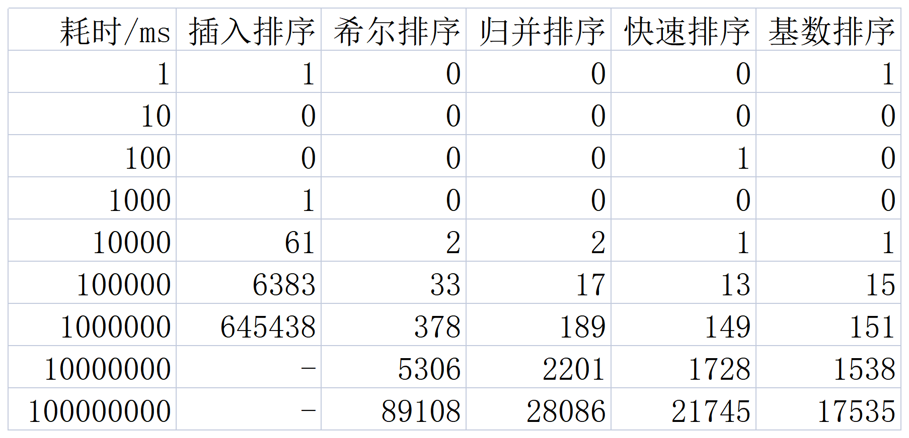
表1 各方法耗时

拟合的曲线如下：

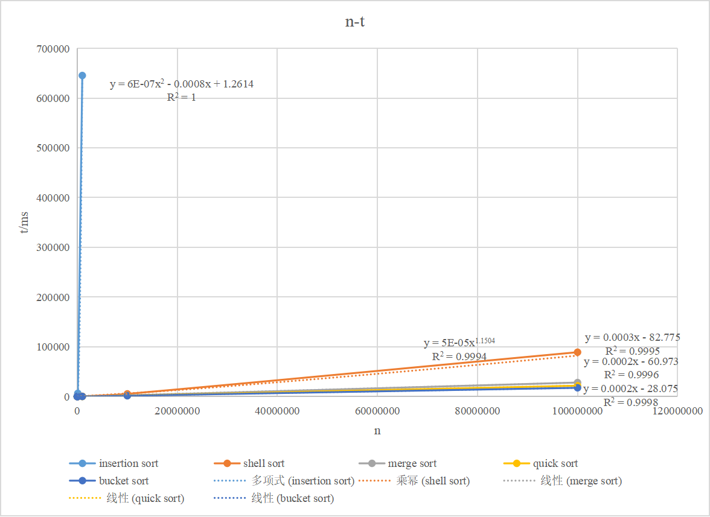
图1 各方法耗时

$\qquad$发现插入排序相比于其他集中排序方式慢得多, 希尔排序突破了 $O(n^2)$ 的时间复杂度, 比插入排序有很大的提升。而快速排序和归并排序比希尔排序更快, 但这二者之间差距较小。基数排序在本次实验中的表现好于快速排序与归并排序。
$\qquad$下面对每一种排序方式进行单独分析。

###### 3.1 插入排序
$\qquad$输入n=1, 10,100, 1000, 10000, 20000, 30000, 40000, 50000, 60000, 70000,80000, 90000, 100000, 1000000，得到如下耗时表格：

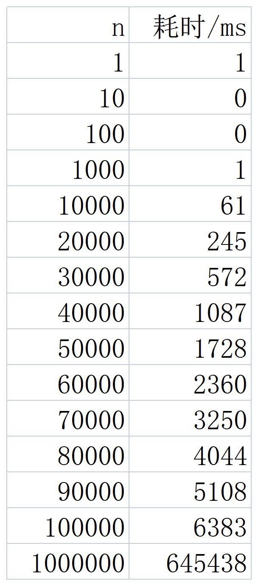
表2 插入排序耗时

画图分析如下：

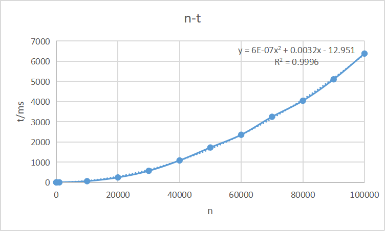
图2 插入排序n与耗时的关系

拟合表达式为

$t=6×10^{-7}n^2+0.0032n-12.951,
 R^2=0.9996$ 

 具有良好的线性，故验证了插入排序时间复杂度为$O(n^2)$.

###### 3.2 希尔排序
$\qquad$输入n=1, 10, 100, 1000, 10000,100000, 1000000, 5000000, 10000000, 50000000, 100000000，得到如下耗时表格：

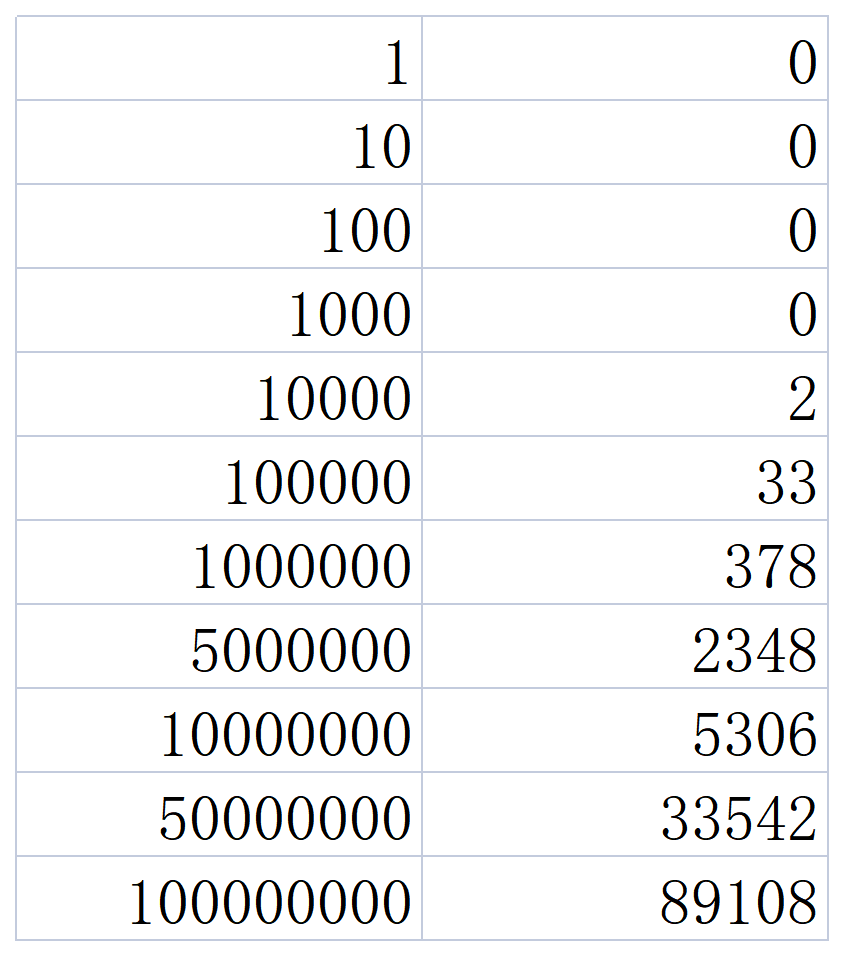
表3 希尔排序耗时

画图分析如下：

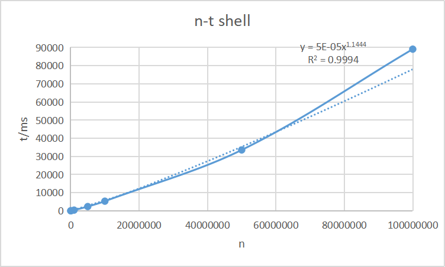
图3 希尔排序n与耗时的关系

拟合表达式为

$t=5×10^{-5}n^{1.1444},
 R^2=0.9994$ 

此时间复杂度大约为$O(n^{1.1444})$，介于$O(nlogn)-O(n^{2})$之间，符合预期。

###### 3.3 归并排序

$\qquad$输入n=1, 10, 100, 1000, 10000,100000, 1000000, 5000000, 10000000, 50000000, 100000000，得到如下耗时表格：

.png)
表4 归并排序耗时

画图分析如下：

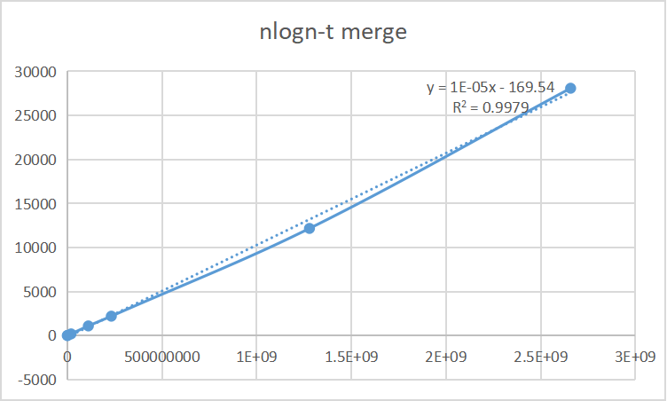
图4 归并排序n与耗时的关系

拟合表达式为

$t=1×10^{-5}nlogn-169.54,
 R^2=0.9979$ 

时间复杂度为$O(nlogn)$，符合预期。
###### 3.4 快速排序

$\qquad$输入n=1, 10, 100, 1000, 10000,100000, 1000000, 5000000, 10000000, 50000000, 100000000，得到如下耗时表格：

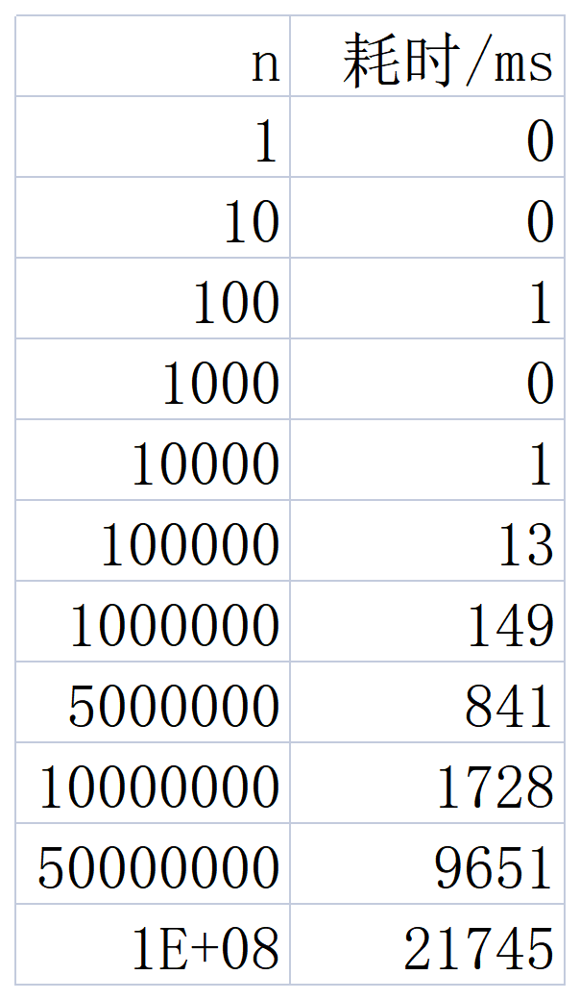
表5 快速排序耗时

画图分析如下：

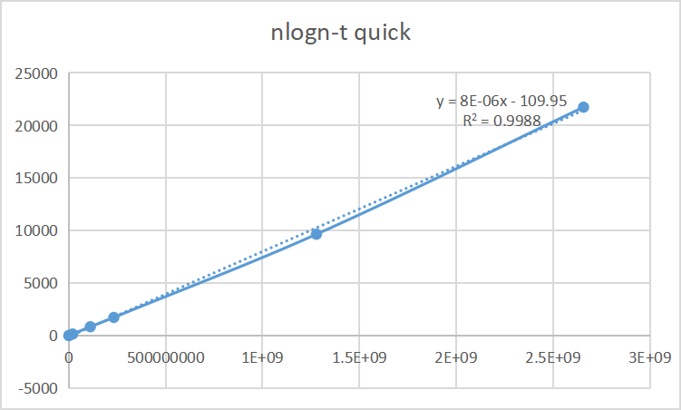
图5 快速排序n与耗时的关系

拟合表达式为

$t=8×10^{-6}nlogn-109.95,
 R^2=0.9988$ 

时间复杂度为$O(nlogn)$，并且快于归并排序，符合预期。

###### 3.5 基数排序

$\qquad$输入n=1, 10, 100, 1000, 10000,100000, 1000000, 5000000, 10000000, 50000000, 100000000，得到如下耗时表格：

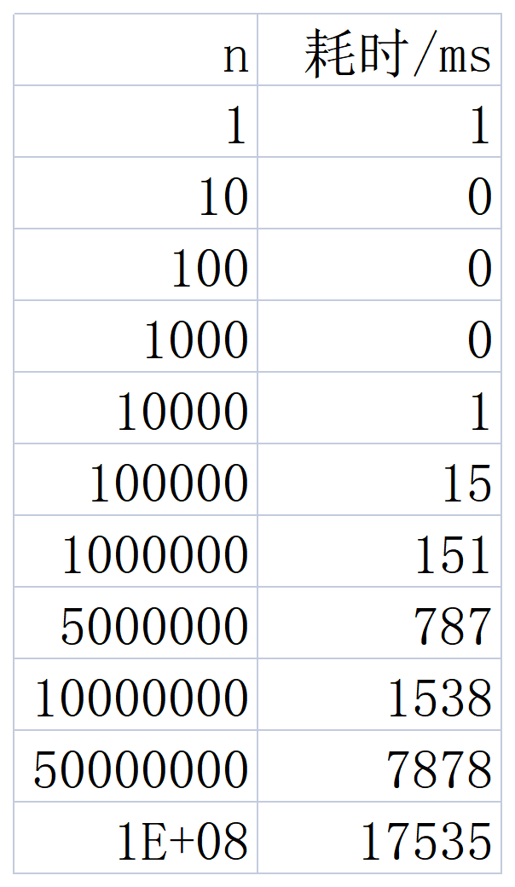
表5 基数排序耗时

画图分析如下：

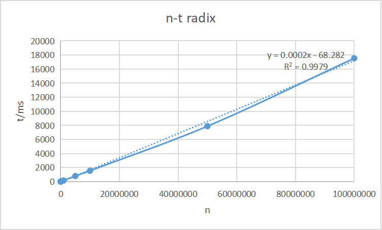
图5 基数排序n与耗时的关系

拟合表达式为

$t=0.0002x-68.282,
 R^2=0.9979$ 

时间复杂度为$O(n)$，并且在n>5000000时快于快速排序。

###### 3.6 分析
$\qquad$插入排序的时间复杂度显著大于其余 4 种排序方式。而其余 4 种中, 希尔排序的时间复杂度较大 (约为 $O(n^{1.1444})$), 快速排序与归并排序的时间复杂度均为$O(nlogn)$, 由实验结果可知, 归并排序的时间复杂度常数略大。而基数排序属于非比较排序, 时间复杂度为$O(n)$在本次实验的 5 种算法中表现最好。
