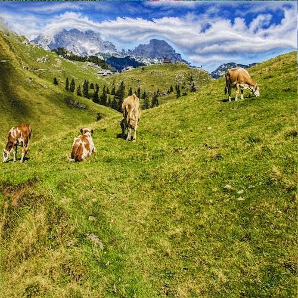

# <center>Report

##### <center>刘喆骐     2020013163    探微化01

<style>
     img[alt="0"]{
        width:300px;
    }
    img[alt="1"]{
        width:200px;
    }
</style>
###1. 实验环境
   $\qquad$win10，visual studio2022（对应opencv4.5.2），ubuntu20.04（对应opencv4.6.0）。
###2. 算法分析
   #### 2.1 计算破坏度
   （1）利用 OpenCv 中的函数 cvtColor 将输入图像转换为灰度图像。
   ```cvtColor(picture, gray_pic, CV_BGR2GRAY);```
   （2）设置卷积核。
   ```
   kernel_Y = (Mat_<float>(3, 3) << 0, 0, 0, 0, 1, 0, 0, -1, 0);
   kernel_X = (Mat_<float>(3, 3) << 0, 0, 0, 0, 1, -1, 0, 0, 0); 
   ```
   （3）利用函数 filer2D 计算水平及竖直梯度, 并相加得到近似的总梯度大小。
   ```
   filter2D(gray_pic, gradient_Y, gradient_Y.depth(), kernel_Y);
   filter2D(gray_pic, gradient_X, gradient_X.depth(), kernel_X);
   ```
   #### 2.2 动态规划
   $\qquad$假设$c[i,j]$表示到达$[i,j]$像素的最优的接缝的破坏度。那么$c[i,j]$会由$c[i-1,j-1],c[i-1,j],c[i-1,j+1]$决定，递推式如下：<center>

$c[1,j]=d[1,j]$,
$c[i,j]=d[i,j]+min(c[i-1,j-1],c[i-1,j],c[i-1,j+1])$</center>
    $\qquad$在动态规划时维护路径数组$r[i,j]$，通过将$r[i,j]$赋值为$-1，0，1$来确定接缝的上一个节点。-1表示左上，0表示正上，1表示右上。最终所求接缝为$min(c[m,j]),j=1,...,n$.通过路径数组找到接缝的所有节点。
### 3. 删除接缝
   $\qquad$得到接缝路径后, 删除接缝路径对应的元素。我使用的方法是删除所有竖接缝以后再旋转图片，进而删除所有横接缝，重新旋转得到输出图片。

### 4. 时间复杂度
   $\qquad$算法共需要遍历m×n个子节点，时间复杂度为$O(mn)$
   $\qquad$验证如下：使用不同像素的图片进行实验，记录耗时，并绘图表示。实验环境为ubuntu。<center>
   
   表1 耗时表格
   
   图0 t-mn 关系。</center>
   $\qquad$t-mn满足关系$t=7*10^{-5}mn-14.813,  R^2=0.9674$。较为线性，符合$O(mn)$的时间复杂度。
### 5. 压缩效果
<center>

   
    图1.1原图
    
    图1.2 图1.1的压缩图
    
    图2.1原图
    
    图2.2 图2.1的压缩图
    
    图3.1原图
    
    图3.2 图3.1的压缩图


   </center>

### 6. 分析
   $\qquad$经过多次测试, 发现程序对元素较少、重点元素不复杂的图片效果较好, 例如说含有大量天空或水面的图片。而对于人像、重点元素复杂的图片效果较差。如下图所示。<center>
   
    图4.1原图
    
    图4.2 图4.1的压缩图
    
    图5.1原图
    
    图5.2 图5.1的压缩图
    </center>
    $\qquad$这是由于对于人像等来说每个像素的都比较重要，删除之后变形会比较严重。而对于图5.1而言，可能是由于能量函数认为树较为重要，而旁边的风景元素不重要，导致树几乎没有被删减，而树结构较为复杂，压缩效果不理想。

